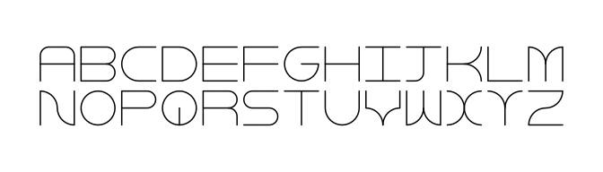
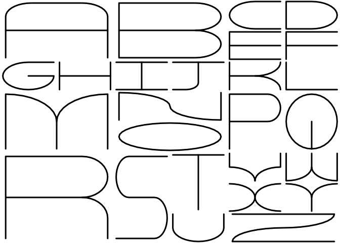

<!-- README.md is generated from README.Rmd. Please edit that file -->

# flexfont

<!-- badges: start -->


[](https://CRAN.R-project.org/package=flexfont)
<!-- badges: end -->

`flexfont` is an R version of the javascript font
[flexflex](https://github.com/ronikaufman/flexflex) by Roni Kaufman.

This is a vector font - each glyph is defined by lines + circle
segments - which means the letters can be made in all shapes and sizes.

This package includes a very minimal SVG path render. Arc path rendering
was borrowed from
[`{svgparser}`](https://github.com/coolbutuseless/svgparser).

### What’s in the box

- `flex_coords()` gives stroke information for drawing this font (in a
  data.frame). The user can then render this however they want.
- `flextextGrob()` is like `grid::textGrob()` but using this flex font

## Installation

<!-- This package can be installed from CRAN -->

<!-- ``` r -->

<!-- install.packages('flexfont') -->

<!-- ``` -->

You can install the latest development version from
[GitHub](https://github.com/coolbutuseless/flexfont) with:

``` r
# install.package('remotes')
remotes::install_github('coolbutuseless/flexfont')
```

Pre-built source/binary versions can also be installed from
[R-universe](https://r-universe.dev)

``` r
install.packages('flexfont', repos = c('https://coolbutuseless.r-universe.dev', 'https://cloud.r-project.org'))
```

# Creating a graphics object

``` r
library(grid)
x <- "abcdefghijklm\nnopqrstuvwxyz"
g1 <- flextextGrob(x, gp = gpar(lwd = 1.5), default.units = 'cm', vgap = 0.3, hgap = 0.2) 
grid.newpage(); 
grid.draw(g1)
```



## Vector font shenanigans

``` r
library(flexfont)
library(grid)
library(gridExtra)

# Define a layout
lay <- rbind(
  c( 1,  1,  2,  2,  3,  4),
  c( 1,  1,  2,  2,  5,  6),
  c( 7,  8,  9, 10, 11, 12),
  c(13, 13, 14, 14, 16, 17),
  c(13, 13, 15, 15, 16, 17),
  c(18, 18, 19, 20, 22, 23),
  c(18, 18, 19, 20, 24, 25),
  c(18, 18, 19, 21, 26, 26)
)

# A grob for each letter
grobs <- lapply(letters, flextextGrob, w = 0.9, h = 0.9, gp = gpar(lwd = 3)) 

# Place the grobs into the layout
grid::grid.newpage()
gridExtra::grid.arrange(
  grobs = grobs,
  layout_matrix = lay
)
```



## Custom plotting of coordinates

This example illustrates how to get the raw coordinates for the letters
and plot manually.

``` r
library(flexfont)
library(ggplot2)  

coords <- flex_coords('hello\nrstats', w = 1.5, vgap = 0.3, hgap = 0.2)
head(coords)
#>   chr_idx chr stroke_idx   x             y
#> 1       1   h          1 0.0  5.551115e-17
#> 2       1   h          1 0.0 -1.000000e+00
#> 3       1   h          2 1.5  5.551115e-17
#> 4       1   h          2 1.5 -1.000000e+00
#> 5       1   h          3 0.0 -5.000000e-01
#> 6       1   h          3 1.5 -5.000000e-01

ggplot(coords) + 
  geom_path(aes(x, y, group = interaction(chr_idx, stroke_idx)), linewidth = 3, lineend = 'round') + 
  coord_equal() +
  theme_void()
```


## Related Software

- [`{lofifonts`}](https://cran.r-project.org/package=lofifonts)
- [`{bittermelon}`](https://cran.r-project.org/package=bittermelon)
